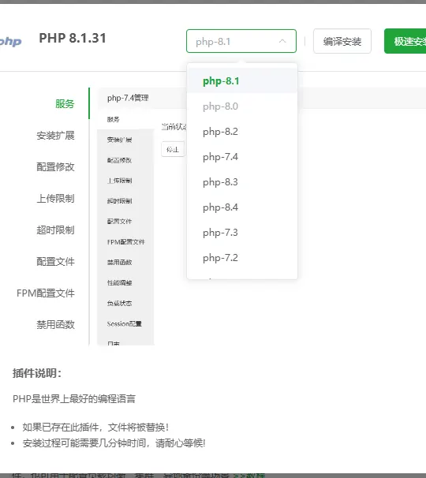
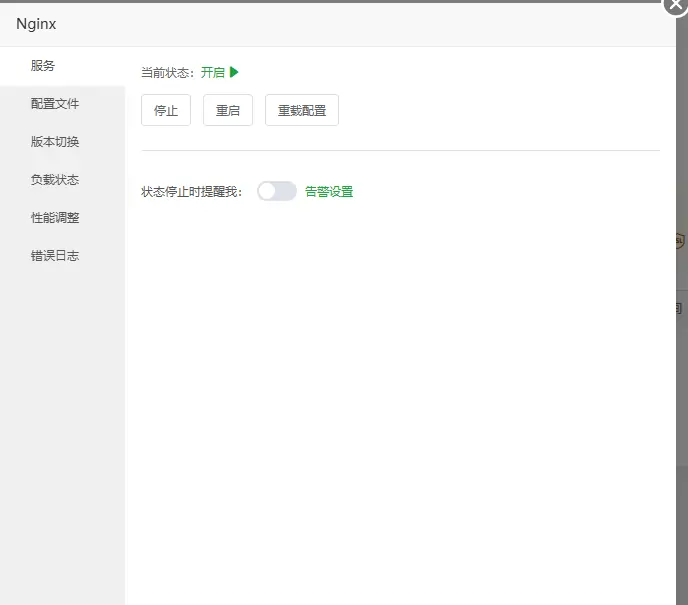
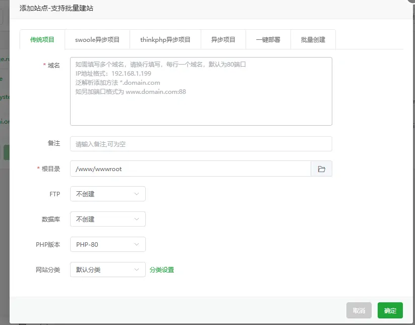
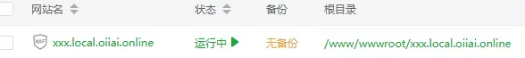
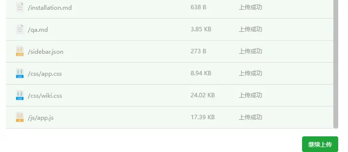
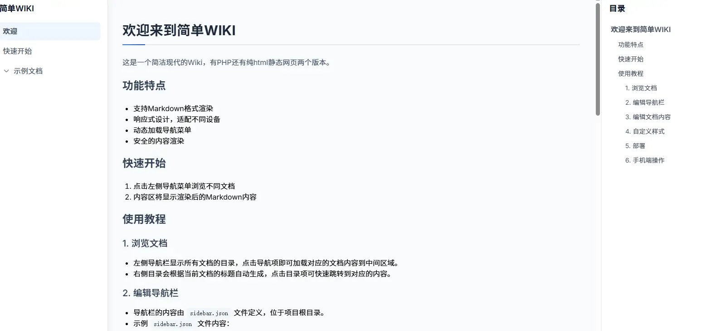

# 安装指南

## 1.选择版本
目前我们有两个版本，一个是有PHP的，一个是纯HTML的。以上两种的功能都是一样的，目前都是v1.0版本，未来我们会更新PHP，但是纯HTML版本将**不会**更新。

|                              |HTML                               | PHP                                |
|------------------------------|-----------------------------------|------------------------------------|
| 版本                         |          v1.0                        |     v1.0                               |
| 未来是否会更新                         |          暂时没打算                         |              是                      |
| 是否有WX QQ自动防红                     |           否                        |                          是           |

> **注意**：我们更加推荐您使用PHP版本,除开某些不适用的情况，请自行选择。

---

## 2.下载
您可以访问我们的github仓库，下载我们的代码。或者点击下面的链接下载v1.0.0版本。

[Github](https://github.com/SnowBall-Bqiu/easywiki/releases)

---
## 3.部署
目前我们的部署方式有两种，一种是纯HTML部署，一种是PHP部署。具体的您可以根据实际来选择。
### 3.1 纯HTML部署
纯HTML部署是指您直接将下载的HTML文件放到您的服务器上，然后就可以直接访问了。或者是使用GitHub Pages，或者小黄云（cloudflare）又或者是其他一些静态网站托管平台。
同时您可以考虑使用薪火智能云进行部署，目前他们有活动，您可以在 [这里](https://www.xinhuo.ink) 查看。
### 3.2 PHP部署
这里我们使用宝塔举例，您也可以使用其他面板。
1. 首先您需要安装PHP环境，如果您没有安装PHP环境，您可以使用宝塔的安装PHP环境功能。

这里您可以选择编译安装或者是急速安装。
2. 安装Web服务器。

这里我们使用NGINX。因为我们目前已经安装好了，就不展示了。
3. 创建网站

这里我们创建了一个网站，填写好您的域名，选择好PHP版本就可以了。
4. 配置网站

点击网站根目录，来到根目录。

上传项目文件
访问您设置的域名即可使用！

